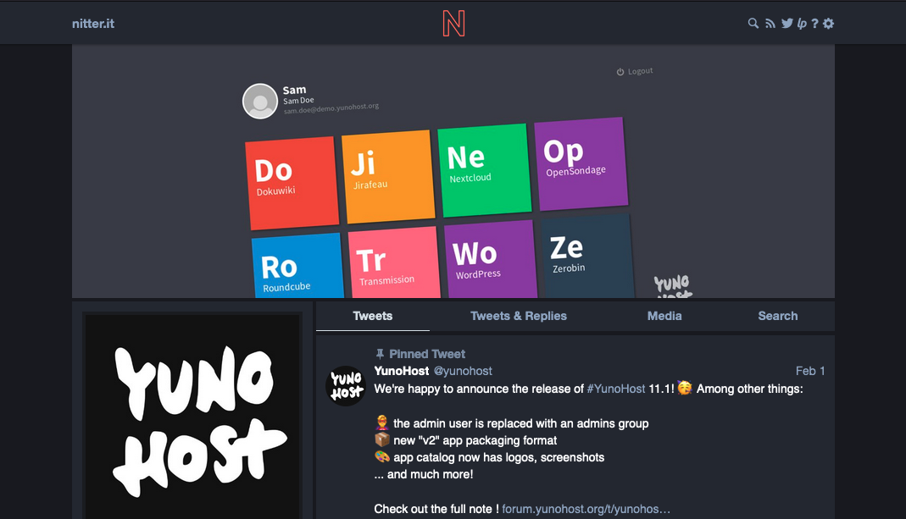

<!--
N.B.: This README was automatically generated by https://github.com/YunoHost/apps/tree/master/tools/README-generator
It shall NOT be edited by hand.
-->

# Nitter pour YunoHost

[](https://dash.yunohost.org/appci/app/nitter)    
[](https://install-app.yunohost.org/?app=nitter)

*[Read this readme in english.](./README.md)*

> *Ce package vous permet d'installer Nitter rapidement et simplement sur un serveur YunoHost.
Si vous n'avez pas YunoHost, regardez [ici](https://yunohost.org/#/install) pour savoir comment l'installer et en profiter.*

## Vue d'ensemble

Nitter est une interface alternative pour Twitter qui est plus rapide que le site officiel, respecte votre vie privée, est ne nécessite pas de s'enregistrer. Son nterface s'adapte aux écrans de toutes tailles. Nitter offre aussi de générer des flux RSS à partir des timelines des utilisateurs Twitter.

### Fonctionnalités

- Pas de JavaScript ni de publicités
- Toutes les demandes passent par le backend, le client ne communique jamais avec Twitter
- Empêche Twitter de suivre votre adresse IP ou votre empreinte JavaScript
- Utilise l'API non officielle de Twitter (aucune limite de débit ni compte de développeur requis)
- Léger (pour @nim_lang, 60KB contre 784KB de twitter.com)
- Flux RSS
- Thèmes
- Support mobile (conception réactive)


**Version incluse :** 2022.09.20~ynh1 *(:warning: Il s'agit de la branche `testing`. La [branche `master`](https://github.com/YunoHost-Apps/nitter_ynh/tree/master) utilisée dans le catalogue est actuellement en 2022.06.23\~ynh1.)*


**Démo :** https://nitter.net/

## Captures d'écran



## Avertissements / informations importantes

### Configuration

Cette application nécéssite un domaine dedié.

Le ficher de configuration de Nitter se trouve à `/var/www/nitter/nitter.conf` (pour la première installation, les prochaines installations iront dans `nitter__2`, `nitter__3`, etc). Les utilisateurs peuvent modifier les paramétres par défaut en visitant `https://instance-domain.tld/settings`.
## :red_circle: Fonctions indésirables

- **Non-free Network Services**: Promotes or depends entirely on a non-free network service.

## Documentations et ressources

* Site officiel de l'app : <https://nitter.net/>
* Documentation officielle de l'admin : <https://github.com/zedeus/nitter/wiki>
* Dépôt de code officiel de l'app : <https://github.com/zedeus/nitter>
* Documentation YunoHost pour cette app : <https://yunohost.org/app_nitter>
* Signaler un bug : <https://github.com/YunoHost-Apps/nitter_ynh/issues>

## Informations pour les développeurs

Merci de faire vos pull request sur la [branche testing](https://github.com/YunoHost-Apps/nitter_ynh/tree/testing).

Pour essayer la branche testing, procédez comme suit.

``` bash
sudo yunohost app install https://github.com/YunoHost-Apps/nitter_ynh/tree/testing --debug
ou
sudo yunohost app upgrade nitter -u https://github.com/YunoHost-Apps/nitter_ynh/tree/testing --debug
```

**Plus d'infos sur le packaging d'applications :** <https://yunohost.org/packaging_apps>
